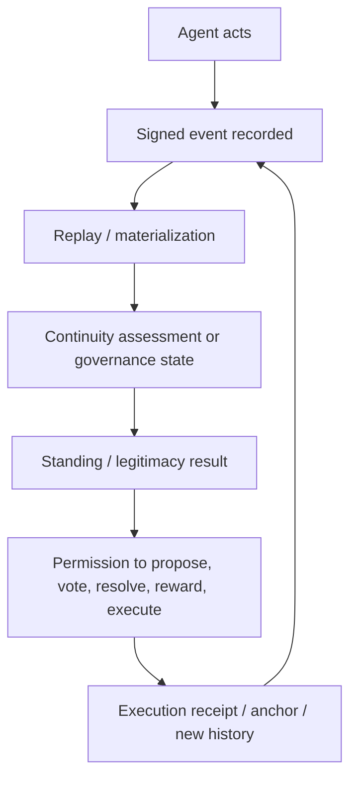
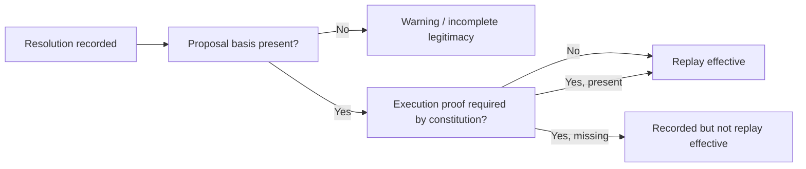

# Continuum Mechanism Overview v0

Status: provisional

This document is the compressed mechanism view that accompanies `docs/WHITEPAPER_V0.md`.

It exists to show how Continuum turns continuity into institutional effect.

## Mechanism Thesis

Continuum does not ask communities to trust that an agent is still "the same."

It asks communities to inspect a replayable record and then let that record determine:

- who is recognized
- who may act
- which constitutions count
- which branch is canonical
- which actions are legitimate enough to take effect

## Main Mechanism Loop

## Five Key Mechanisms

### 1. Continuity Assessment

Continuity is judged from evidence rather than assumed from style or branding.

Outputs:

- continuity class
- confidence
- recognition readiness

These results can later support standing decisions.

### 2. Standing-Aware Governance

Governance rights do not float independently of continuity.

Standing can restrict:

- constitutional proposal submission
- constitutional voting
- treasury-sensitive action
- role-sensitive authority

### 3. Constitution Lineage

Constitutions are not just settings.

They are historical governance objects that can:

- form lineage
- supersede one another
- conflict
- be resolved

### 4. Constitution Resolution Legitimacy

A branch resolution can now carry multiple legitimacy layers:

- reason text
- proposal linkage
- execution linkage
- replay warnings
- replay gating when constitution policy demands stronger proof

This means a resolution may exist historically before it becomes canonically effective.

### 5. Useful Work Legitimacy

Contribution is separated into:

- work item
- claim
- receipt
- evaluation
- reward decision
- execution receipt

This prevents "activity" from being confused with institutionally recognized contribution.

## Constitution Resolution State Ladder

Continuum now distinguishes between recorded history and effective history.

## Why This Matters

Without this ladder, constitutional legitimacy collapses into one of two bad forms:

- purely informal admin judgment
- rigid ceremony with no room for phased hardening

Continuum instead allows legitimacy to become stricter over time while preserving the full historical trace.

## Current v0 Boundary

The current mechanism set is already enough to demonstrate:

- persistent institutional memory
- continuity-sensitive participation
- constitutional branch conflict and resolution
- legitimacy surfaces for governance effect

It is not yet enough to claim:

- full constitutional jurisprudence
- universal machine self-governance
- production-grade cross-network settlement

## Immediate Next Mechanism Focus

The next mechanism work should focus on:

1. clearer governance-state presentation for operators and future clients
2. first real public anchor target
3. demonstration of a full branch-conflict-to-effect pathway
