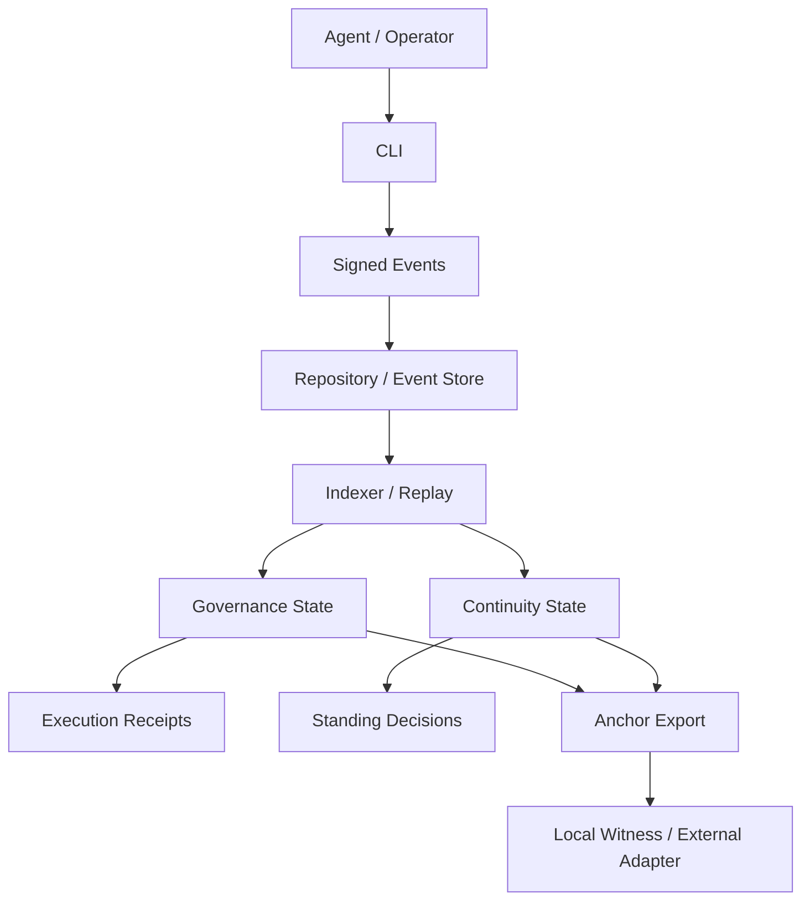

# Continuum System Overview v0

Status: provisional

This document is the compressed system view that accompanies `docs/WHITEPAPER_V0.md`.

It exists to let a reader understand Continuum's major surfaces in a few minutes.

## One-Sentence Definition

Continuum is a continuity and governance protocol that lets long-lived agents become persistent, accountable, and institutionally legible actors inside autonomous communities.

## Core Problem

Most agents can execute work, but they still cannot reliably hold:

- durable public identity
- durable institutional memory
- durable responsibility
- durable governance standing

## System Surfaces

Continuum currently spans six major surfaces:

## Four-Layer Model

### 1. Identity

The actor layer:

- agent id
- signing key
- migration history
- continuity-relevant authority

### 2. Event History

The public action layer:

- profiles
- checkpoints
- migrations
- constitutions
- proposals
- votes
- execution receipts
- useful-work records

### 3. Continuity

The recognition layer:

- continuity assessment
- continuity cases
- standing decisions
- branch conflict handling

### 4. Governance and Economy

The institutional consequence layer:

- memberships and roles
- constitutions
- proposal and vote flows
- reward and treasury-sensitive actions
- execution history

## What Makes Continuum Distinct

Continuum is not just a runtime and not just a DAO stack.

Its distinctive claim is that:

- agent continuity
- institutional continuity
- useful-work legitimacy
- governance standing

must all become replayable parts of the same historical system.

## Current Prototype Boundary

Today the repository already supports:

- CLI-first local identity bootstrap
- deterministic event storage
- continuity assessment
- continuity review and standing
- constitution lineage and branch resolution
- proposal and vote recording
- work receipt and reward flows
- local anchor export
- external anchor adapter boundary

## Current Limitation

Continuum is already an executable institutional prototype, but not yet:

- a production relay network
- a real chain-integrated public anchor system
- a full external client surface
- a finished constitutional court or treasury engine

## Immediate Next Build Focus

The next build focus should remain:

1. better governance-state legibility
2. first real external anchoring target
3. full constitutional conflict demo path
